For an undergraduate research project, I created a system based off of the one  [designed by Nathan Rooy](https://nathanrooy.github.io/posts/2019-02-06/raspberry-pi-deep-learning-traffic-tracker/). Many thanks to Nathan for having kept in touch with me via LinkedIn and helping me with any issues I had along the way, as well as creating the project to begin with.

The system is a Raspberry Pi that runs an object classification TensorFlow model and stores detection data in a CSV for further analysis. Read more of the project concept and statistical analysis  **in the other article on my profile (which I will post here later when it is complete)**. This article is designed as a setup guide for anyone looking to replicate the system.

### Materials

To build the project, you will need the following materials. I will link to where I purchased them from, so if they’re no longer available, run a Google search to check elsewhere:

-   Raspberry Pi 4 B (2GB RAM) — $35:  [pishop.us](https://www.pishop.us/product/raspberry-pi-4-model-b-2gb/)
-   Raspberry Pi NoIR Camera v2 — $30:  [Adafruit](https://www.adafruit.com/product/3100#tutorials)
-   MicroSD 32GB, with an SD adapter,  [from this list](https://elinux.org/RPi_SD_cards)  of compatible cards. I got mine from Staples at $14.
-   3ft Ethernet Cable — $5:  [OfficeDepot](https://www.officedepot.com/a/products/417157/Ativa-Cat-5e-Ethernet-Cable-3/?utm_source=google&utm_medium=cpc&&gclsrc=aw.ds&gclid=CjwKCAiA4rGCBhAQEiwAelVti98n7hHsRZZAki_B-ZUTrnAU2nfZR7HlsfJPwivIhrJrQASaM1kDNhoCnCkQAvD_BwE&gclsrc=aw.ds)
-   j5Create USB 3.0 Gigabit Ethernet Adapter (JUE130) — $25:  [BestBuy](https://www.bestbuy.com/site/j5create-usb-3-0-to-gigabit-ethernet-adapter-gray/2001047.p?skuId=2001047&ref=212&loc=1&ref=212&loc=1&ds_rl=1264993&ds_rl=1264987&gclid=CjwKCAiA4rGCBhAQEiwAelVti4vp5oMBqE6Q9toYnkuC_vuz-ySOt11tfPZiV0o624n8w9IOuiVMbhoCauUQAvD_BwE&gclsrc=aw.ds). Note: you don’t need this if your computer already has an ethernet adapter.
-   Large Plastic Project Enclosure — $20:  [Adafruit](https://www.adafruit.com/product/905).
-   INIU 18W 20000mAh Power Bank — $20:  [Amazon](https://www.amazon.com/gp/product/B07YCR7FR9/ref=ppx_yo_dt_b_asin_title_o00_s00?ie=UTF8&psc=1). For this, you must be  **absolutely sure** that the battery is 5.3 inches in length or less, unless you plan on getting a larger project box than the one I am using here. For this project, I needed to run the system for about 16 hours straight, so 20000mAh was appropriate for this. You may adjust that capacity as necessary, but beware the size constraints of your project box. Additionally, the Pi 4 takes power via USB-C, so be sure your battery includes a USB-C cable, or get an adapter.
-   Neodymium Countersunk Ring Magnets N42 (20 Pack) — $15:  [totalElement](https://totalelement.com/collections/countersunk-discs/products/1-2-x-1-8-x-1-8-inch-neodymium-rare-earth-countersunk-ring-magnets-n42-20-pack). It doesn’t have to be these exact neodymium magnets, but be sure whatever you get are N42 and are a “ring” magnet as you will need to use a screw to attach them to the project case.
-   Plan to budget an additional  **$20** toward  any additional adhesive materials, screws, nuts, etc.
-   Computer preferably running Ubuntu 20.04 (Windows 10 and MacOS pre-BigSur work too, this is just for driver compatibility with the ethernet adapter).

In total, you’re looking at around  **\$185** for the system. This is  _considerably less expensive_ than the $450+ pneumatic tube systems.

### Pi Configuration

Once you have everything delivered, you’ll need to install Raspbian OS onto the microSD card and do some configuration on the Pi.

#### Install Raspbian OS

Insert the microSD into a microSD reader or adapter that goes into your computer. Raspberry Pi provides a utility that makes doing this fairly quick and easy.  [Download Raspberry Pi Imager](https://www.raspberrypi.org/software/), and install.

Once installed, open Raspberry Pi Imager. Select OS as Raspbian Pi OS (32-bit), and choose the microSD card you just inserted into your computer.

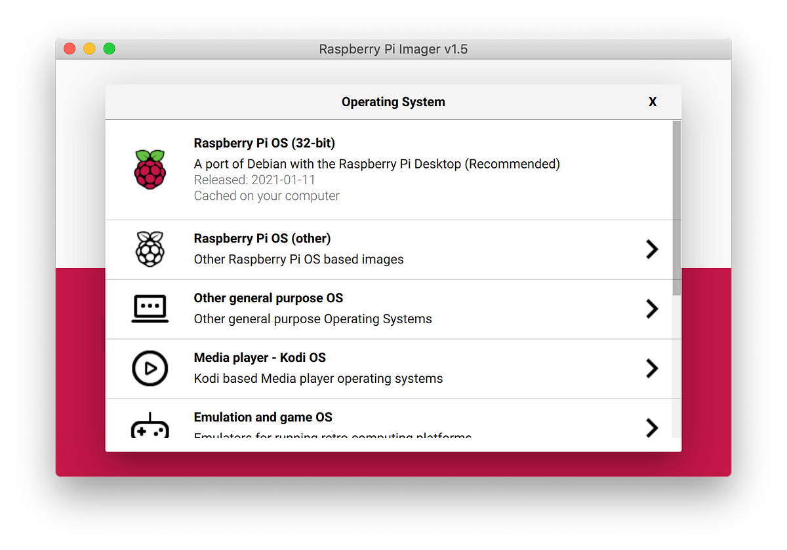
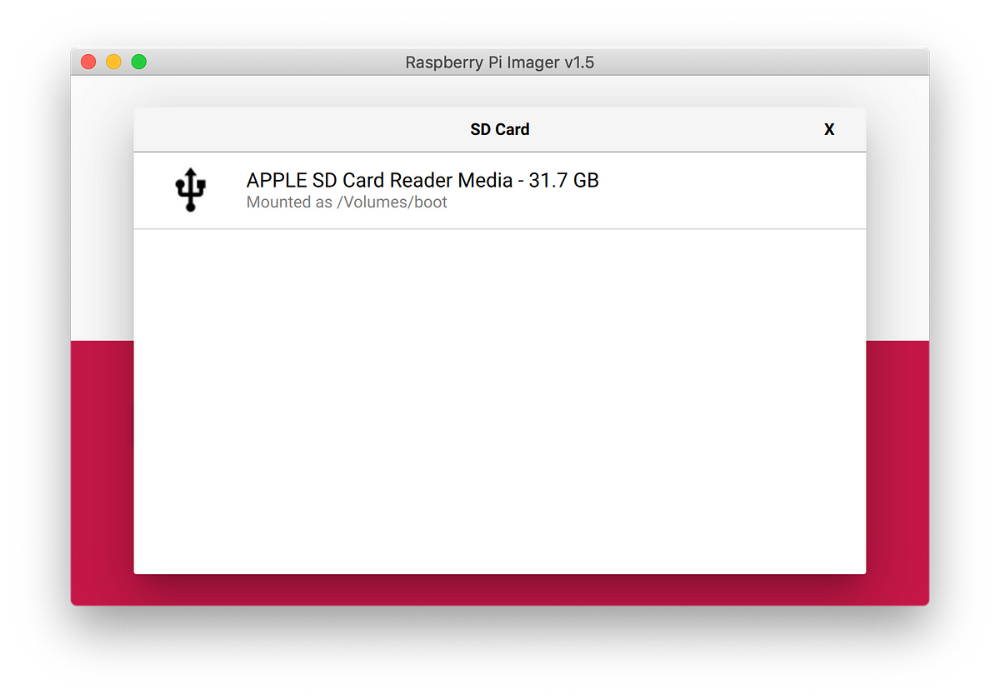

> **UPDATE 2022:** For security, all RPis are being shipped without an account setup for security purposes. Before flashing your microSD, be sure to click the cogwheel at the bottom right hand corner of the Imager window. Select “Enable SSH”, and add the desired username and password.

Once you’ve done so, start the install. It should take a few minutes, depending on the transfer speed of your microSD card. Once your install is finished, you need to configure a few things to make it boot up and be visible by your machine.

#### Edit config.txt on the boot partition

Now that you’ve installed Raspbian, with the SD card still in your computer, navigate to the boot directory on the SD card, and open the file called  **config.txt**.

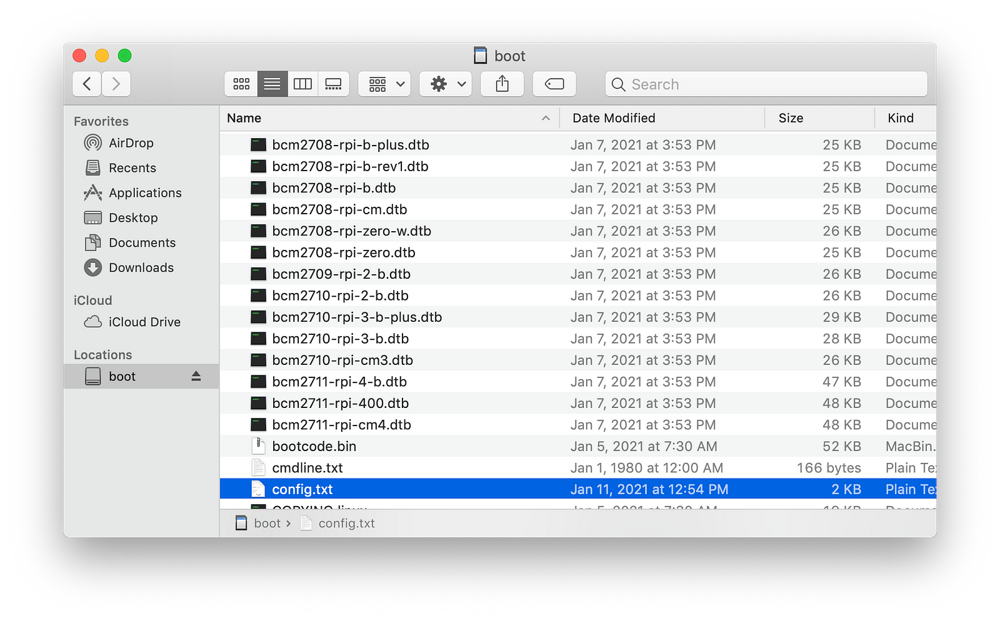

At the end of the file, you’re going to want to add the following:
```
dtoverlay=dwc2
```
The end result should look like the image below. Make sure you save and exit when done.

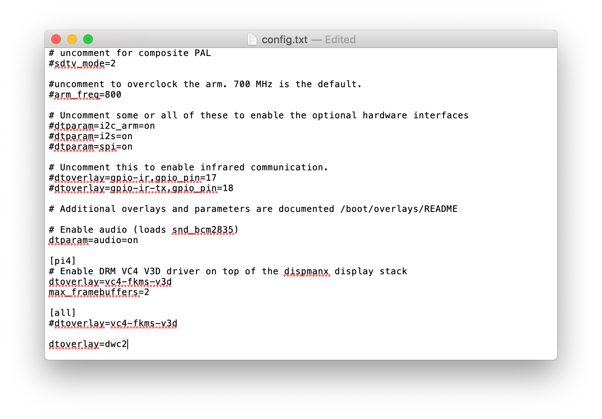

#### Enable SSH, so you can talk to your Pi

With the SD card still in your computer, create a file in the root directory of the card by making an empty file called ssh there. However you choose to do that is by your means. Personally, I just navigated to the directory and used a command.
```bash
cd ../.. # This takes you to the root directory of a Mac from your home directory 
cd Volumes/boot # Replace "boot" with the name of the SD card volume
touch ssh # The touch command creates a file with the given name  
ls # Check to make sure the file was created
```

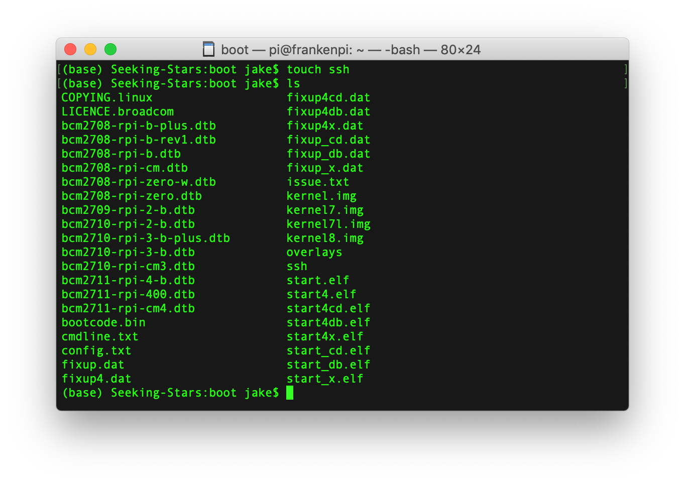

#### Edit cmdline.txt

Edit the file called  **cmdline.txt.** Find  **rootwait**, and add the following, with a space before and after it:
```
modules-load=dwc2,g_ether
```
The resulting file should look something like this once you’ve done that:
```
console=serial0,115200 console=tty1 root=PARTUUID=84b6fcd0–02 rootfstype=ext4 elevator=deadline fsck.repair=yes rootwait **modules-load=dwc2,g_ether** quiet splash plymouth.ignore-serial-consoles
```
Be sure to save and exit when done.

#### Connect to your Pi

Everything is set up now so you can access your Pi. Eject your SD card, and insert it into the microSD slot on your Pi.

First, insert the USB-Ethernet adapter into your computer, if this applies to you. Mac and Windows require additional driver installation for this to work properly, so download the appropriate driver (JUE130) from  [this page](https://en.j5create.com/pages/drivers)  and if you’re running Mac or Windows, see the instructions after.

Ubuntu, however, doesn’t need additional drivers to work. Plug in the adapter and reboot. Then, connect the Pi to the adapter using the ethernet cable. Find the wired network settings in Ubuntu, and under IPv4 and IPv6, change the method to “Link-Local Only”. You need to do this since your Pi is not an access point and is not providing internet to your computer. You’ll have a hard time using ssh if you do not complete this step.

For other OS types, there may be additional setup required. J5Create should give you the full setup instructions on installation, otherwise see Google on using a USB-ethernet adapter.

To test to see if your Pi is working, you can simply ping it by using the following command (in Mac/Linux, Windows might be different):
```bash
ping raspberrypi.local # raspberrypi.local is the address of your Pi
```

If all runs well, which it should, you should get a result that looks something like this:

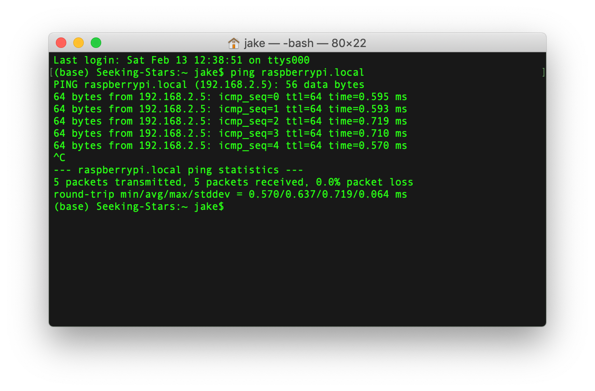

Additionally, you should see both the downlink and uplink LEDs lit on the Pi’s ethernet port and the adapter.

If you end up getting and error that says  **ping: cannot resolve raspberrypi.local: Unknown host**, wait a few moments and try again. The Pi probably didn’t boot up all the way. If you still have issues, use the name  **raspberrypi**. If you are  _still_ having issues connecting to your Pi after that, you may want to restart the process over again from installing Raspbian, or just Google your issues.

#### Access Raspbian (for headless units)

> **UPDATE 2022:**  For security, all RPis are being shipped without the default login pi / raspberry. In Raspberry Pi Imager, you should have configured the advanced settings so SSH is enabled and you have set a username/password of your choice.

If you don’t have a monitor and keyboard available for your Pi, there is an easy fix. Before you can access Raspbian, you need to ssh into the Pi by using the following command:
```bash
ssh pi@raspberrypi.local
```

Accept any prompts that come up, and use the default password to login, which is  **raspberry.**  You should change this later.

Now that you’re logged in via ssh, for what’s next, you need to enable the VNC server which allows you to see and access your Pi’s desktop. To do so, use the following command to access the configuration:

```bash
sudo raspi-config
```
Then, scroll to interface options using the up/down keys, and hit enter to select. Once you’re in the interface options, scroll to  **VNC**  and select  **<Yes>**.

Additionally, you’ll need to go to localisation options and set your locale and timezone, as well as entering the SSID and password of your wi-fi network (so your Pi can connect to the outside world to download dependencies later on).

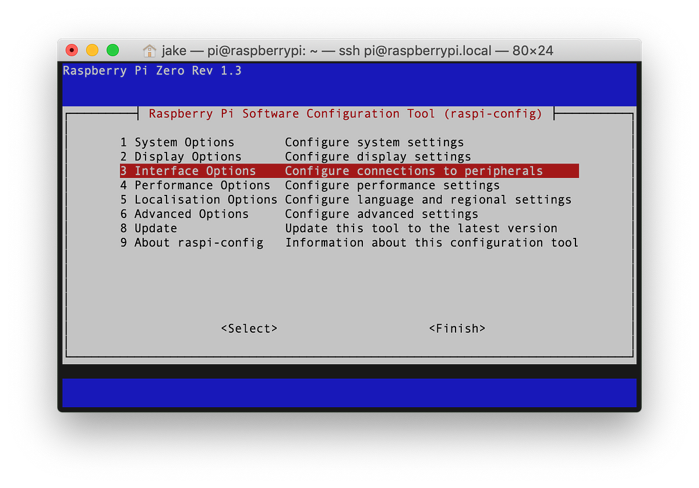
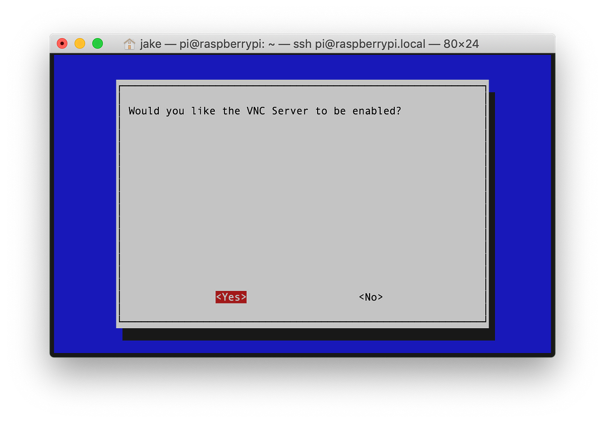

Select  **<Ok>** in the next dialogue, and use the left and right arrow keys to select  **<Finish>**. Your Pi will reboot.

Great, now you’re set up to access your Pi desktop remotely.

You can use  **VNC Viewer** to view the desktop of your Pi and use it through there. I’m won’t go too in detail about how to install this, just go to the  [VNC Viewer download page](https://www.realvnc.com/en/connect/download/viewer/), select the correct installation for your machine, and install. Then, go to  **File >> New Connection…** and type in  **raspberrypi.local** for the VNC server (or whatever name you used in the previous step), and leave the other options alone.

With that installed and set up, you can double click on the connection you just made in VNC Viewer. Hit “Continue” on any prompts that come up, then login using the same credentials as with ssh:
```
# deprecated as of 2025
User: pi  
Password: raspberry
```
When you login, you’ll need to complete the configuration. It should walk you through everything you need to do step-by-step. When you’re done, your Pi is ready to be used remotely! VNC will prove to be useful especially if you need to troubleshoot the model.

### Install Necessary Software Packages

#### Install Docker

To install the model on your Pi system, Nathan Rooy simplified the install of the model and application by dockerizing it. I highly recommend you look into what Docker is and how it works before proceeding, as doing so will help solve any issues you are having, if you have any. Personally, I found  [this 2-minute video](https://www.youtube.com/watch?v=Gjnup-PuquQ)  to be very helpful.

To install docker on a Raspberry Pi, follow the  [Docker documentation install guide for Debian.](https://docs.docker.com/engine/install/debian/#install-using-the-convenience-script)

Then, once you’ve installed Docker, you need to add the current user to the Docker user group (so the user can run the container without needing sudo permissions).
```bash
sudo usermod -aG docker pi
```

If this command executes successfully, it will not output anything. It may yield an error that requires you to create a user group (as the user group does not exist in the first place), which should be solved by using this command, then retrying adding pi to the user group after:
```bash
sudo groupadd docker  
sudo reboot # You need to reboot for the changes to take effect
```

#### Install Urban Mobility Tracker (UMT)

Next, you need to install the application and its dependencies through Docker. So if your docker install isn’t yet working, fix that!

To simplify install and running of the application, I have created a small shell script. In your home directory, download  [install.sh](https://raw.githubusercontent.com/hainesdata/rpi-urban-mobility-tracker/master/shell/install.sh)  from my github repo (forked from  [Nathan Rooy’s repo](https://github.com/nathanrooy/rpi-urban-mobility-tracker)) and run by using the following commands:

```bash
wget [https://raw.githubusercontent.com/hainesdata/rpi-urban-mobility-tracker/master/shell/install.sh](https://raw.githubusercontent.com/hainesdata/rpi-urban-mobility-tracker/master/shell/install.sh)  
chmod +x install.sh  
./install.sh
```

The script should install everything, build the container, and run the container automatically. Go and get some food, as this will take a while — maybe around 20 minutes.

#### Test UMT

Once that’s done, test out UMT with the container running to see if it works.
```bash
cd umt_output # Make sure you are in UMT directory, unless you're already in the running container.  
wget https://github.com/hainesdata/rpi-urban-mobility-tracker/raw/master/sampledata/sampledata-01.mp4 # Downloads sample footage  
umt -video sampledata-01.mp4 -save  
ls output
```
If all works okay, there should be a directory titled ‘output’ which, when running the  **ls output**  command, should contain annotated .jpg images. Additionally, there should exist a CSV file titled ‘object_paths.csv’. Ignore any of the warnings related to TensorBoard or bogomips. That is expected behavior, and does not hinder the model’s functions.

It is also possible that the annotations on the sample video are simply not accurate — again, that is expected behavior. Try running the following, and point your RPi camera around with your surroundings, and hit control + C after a few moments to stop the live analysis:
```bash
sudo rm -rf output object_paths.csv _#Clear recent test results_  
umt -camera -save
```

You should see frames counting, similar to the last analysis. Where there is not a message displaying “no detections…”, the model is detecting objects and all is working. To check your results, you may review the photos in the output directory, or use the frame stitching tool I included in my repo. To use that, run the commands below to download:
```bash
cd ${UMT_DIR}  
wget https://raw.githubusercontent.com/hainesdata/rpi-urban-mobility-tracker/master/shell/stitch.sh 
chmod +x stitch.sh
```

And execute as you normally would a shell script:
```bash
./stitch.sh
```

This takes all the frames and stitches them together in an MP4 video titled “analyzed-frames.mp4”. The video will be quite sped up, and this can be changed by using  **nano** and editing the “setpts” parameter in stitch.sh. If you’re not familiar with how to use nano, here’s a quick instruction for our purposes:
```bash
nano stitch.sh
```

Then use the left and right arrows to scroll to the “setpts” parameter and change as desired. The parameter is a proportion of how long each frame is in length in the video, so smaller numbers means faster video speed. For real-time speed, try PTS*3 or PTS*4. When you’re done, simply CTRL+S to save and CTRL+X to exit nano.

### System Assembly

#### Project Box: Mounting

Project box assembly can be very subjective, since it depends on the magnets you get, project enclosure, and the weight of your system overall. I will be keeping this more general for that reason.

To hold the project box, you need about 3–4 magnets to successfully hold the weight of the project. If you’re using a different project box, 3 may be a good starting point, but increase if you notice your box is sliding when you mount it to a magnetic and vertical surface. In my case, I only needed 3.

You’re going to need a drill for this, as you need to puncture the plastic of the project box to insert a screw (you’ll need screws that fit snugly through your magnets) into it. With Adafruit’s project box, there are already good spots to drill into. It may be different for your case, but either way, nuts come in handy to hold the screws in place from the other side. Just be sure to make the screw placement near the edges of the box, as you may end up having a difficult time fitting the other components in later.

Here’s what mine looked like:

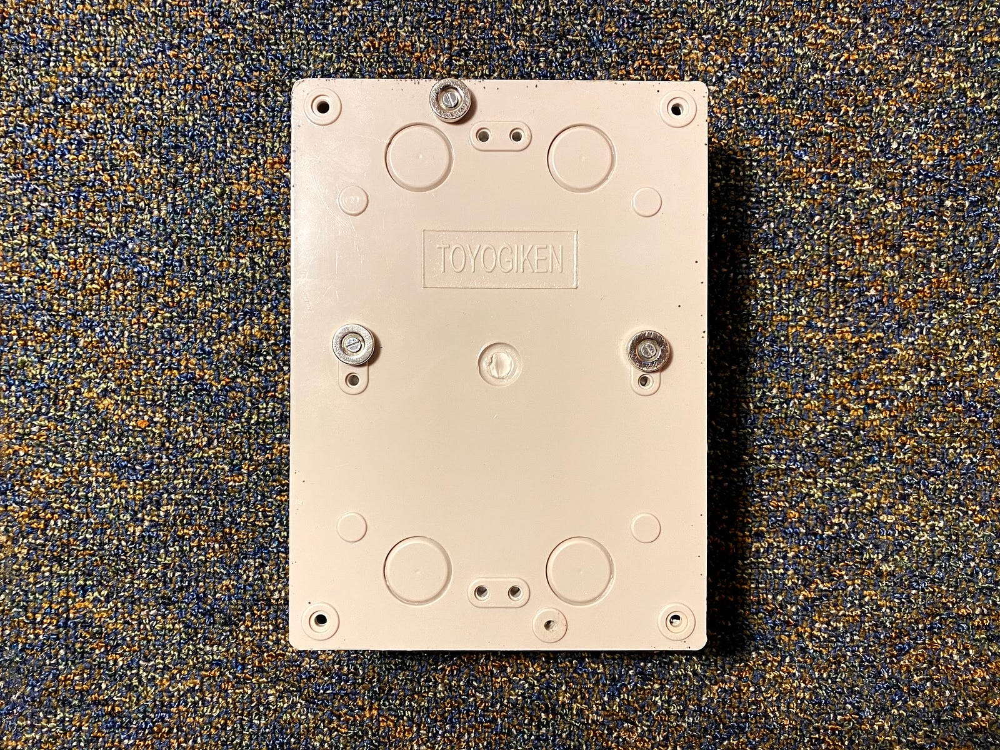
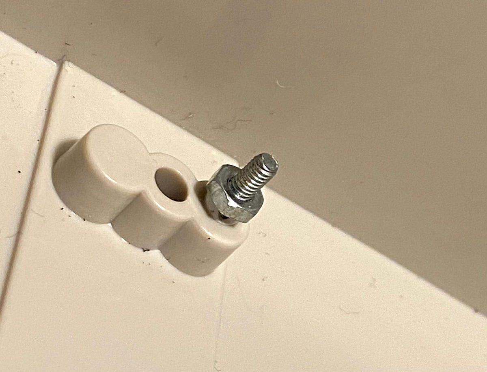

#### Project Box: Camouflaging

Depending on the environment you set up your system in, you may want to make your system more discrete for the purposes of preventing any kind of tampering or theft. This is especially true with Adafruit’s project box, as the lid is clear so you can see everything.

In my case, I painted the box. I simply placed a penny over a spot on the lid while it is on the box (as to create clearance for the camera), and used Plasti-Dip to cover the enclosure (except the bottom side with the magnets) in matte black. I didn’t make it anything perfect — it just had to do its job of making it less noticeable, which it did. Also, if you’re not familiar with Plasti-Dip, be sure to read more about it  [here](https://plastidip.com/our-products/plasti-dip/). It’s an incredible product that can be used for multiple purposes. In short, it’s paint that can be peeled like rubber and not leave a mark.

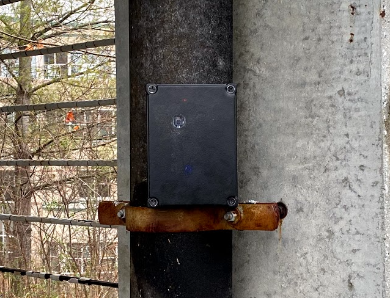

Yes, the lights of the system are dim but still visible, especially at night. This is especially useful when testing, as you can monitor the battery level throughout the day without needing to undo the enclosure.

#### Adding the components

The next step would be to add all the components (battery and Pi w/ camera) to the enclosure. I would highly recommend using 5–10lb velcro strips to hold the battery onto the enclosure, along with command strips to hold the Pi in place on the battery. Of course, it is completely optional to do this and you may go about it however you’d like. Keep in mind that the Pi heats up quite a bit, so the adhesive or mounting device has to be able to hold through that.

Personally, I was on a tight budget and ended up leaving everything loose, as the battery fit almost perfect when it had a wire connected, and the Pi wouldn’t go anywhere. I duct-taped the camera to the lid to hold it in place. See below for what mine looked like:

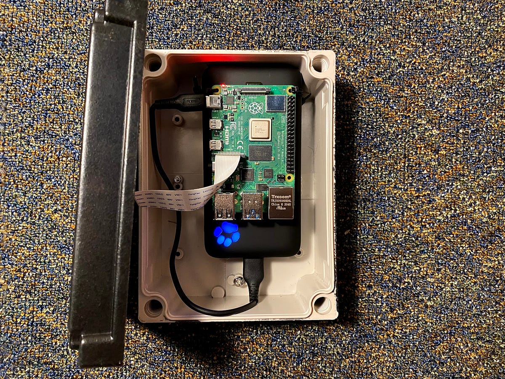
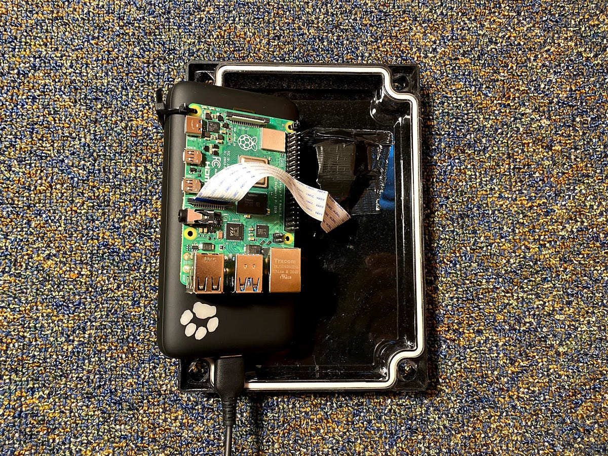

I didn’t end up needing velcro for this battery. Because of the USB cable attached to the battery, the battery fit tightly into the case and was made with an elastic-like finish that held it into place. If you’re going to do it this way, for the sake of the poor wire, make sure that the wire is bent in the same direction each time you insert the battery and doesn’t have too much tension in it when doing so. I’m sure engineers are understandably laughing at this, but it’s as functional as it needs to be for my purposes.

#### System Field Testing

Now that the assembly is done and UMT is up and running, the system can finally see the light of day. You’ll need to take a laptop, ethernet adapter (if applicable), ethernet cable, and of course, the system with you to wherever you plan on testing it.

Connect to the Pi by opening VNC and connecting to the host that we set up earlier. With the Pi’s desktop open in VNC Viewer, start a terminal within the remote desktop.

With the case open and UMT-Pi connected to your laptop, start the container. You can run the  **init.sh**  shell file downloaded by  **install.sh** to automatically start everything, provided you already installed UMT. If you haven’t yet installed UMT, your Pi will need to be connected to the internet to do so. With the Docker container started, run the following to start UMT and enable background processing:
```bash
nohup umt -camera -save
```

Because we are running UMT with nohup, there will be no output on the terminal. The output will be directed to a file called nohup.out, so should any errors arise (stops recording out of nowhere, memory leaks, etc), you have the output file to look for any errors. Additionally, use  [syslogs](https://stackoverflow.com/a/10979779)  to help troubleshoot. The method to run UMT is the same regardless of whether you are testing or in the real data collection phase.

Once you’ve started the model, wait a few moments, and then disconnect the ethernet cable from the Pi, close the enclosure, and mount it. Your system should be recording (and will also record you opening and closing the enclosure — _for accurate analysis, you should exclude the first and last couple hundred frames or so. This depends on how long it takes you to setup/shutdown_).

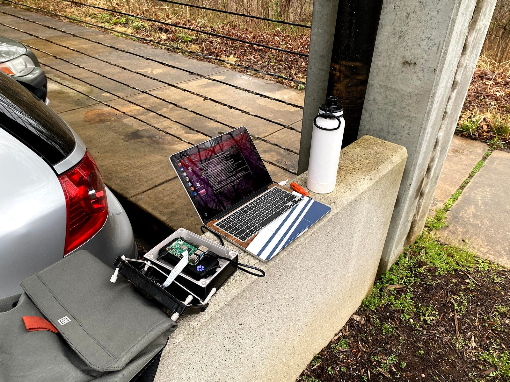

Feel free to pack your stuff up and leave for a while, but note that the  `-save`  flag used earlier is only useful with less than 2 hours of testing. Docker will kill the process after almost 2GB of images is reached since the saved images are temporarily stored in memory (this is the nature of how Docker containers work). When you’re ready to stop it, unmount it, open the enclosure, insert the ethernet cable, reconnect to the Pi in VNC, and finally hit Ctrl+Z in the terminal window (which should still be open) to stop the process. It may take a few moments for the console to respond. But once it’s done, you can run stitch.sh or manually look at the frames, provided you ran UMT with  `-save`. Furthermore, all data will be included in the outputted CSV.

If all worked well, your model should be detecting everything smoothly. If not, you may want to adjust the sensitivity threshold as per  [Nathan’s documentation](https://github.com/nathanrooy/rpi-urban-mobility-tracker/blob/master/README.md), and test other angles while recording.

You should also test at night. I noticed the model struggles with detection in dimly lit areas and/or when automobile high-beams are present. Then again, angles can directly affect auto-exposure, which will affect the object detection. Moreover, test during the rain or build an “umbrella” for the lens area. If raindrops cover the plastic that the lens sees out of, the model will most likely struggle with detection and/or classification. The model also detects stationary vehicles, so avoid angling directly at parking lots if measuring traffic, as that may affect the data analyses.

### Conclusion

Now that you’ve built the system and tested it, the rest of the study is yours to conduct. Personally, I would be using the classification and x/y data included in the CSV for finding direction of traffic and if something was a car or not. Be sure to charge your battery however often, and account for any missing data. It may be easier to record data over consistent time intervals if this is the case.

I hope that this guide is informative and will help you in your research. If there are any issues along the way, please open an issue on  [my Github repo](https://github.com/hainesdata/rpi-urban-mobility-tracker/issues). If you are interested in my analysis of the data collected and my application of the system, please visit the other article on my profile involving parking traffic. I will post a link here when it is complete.