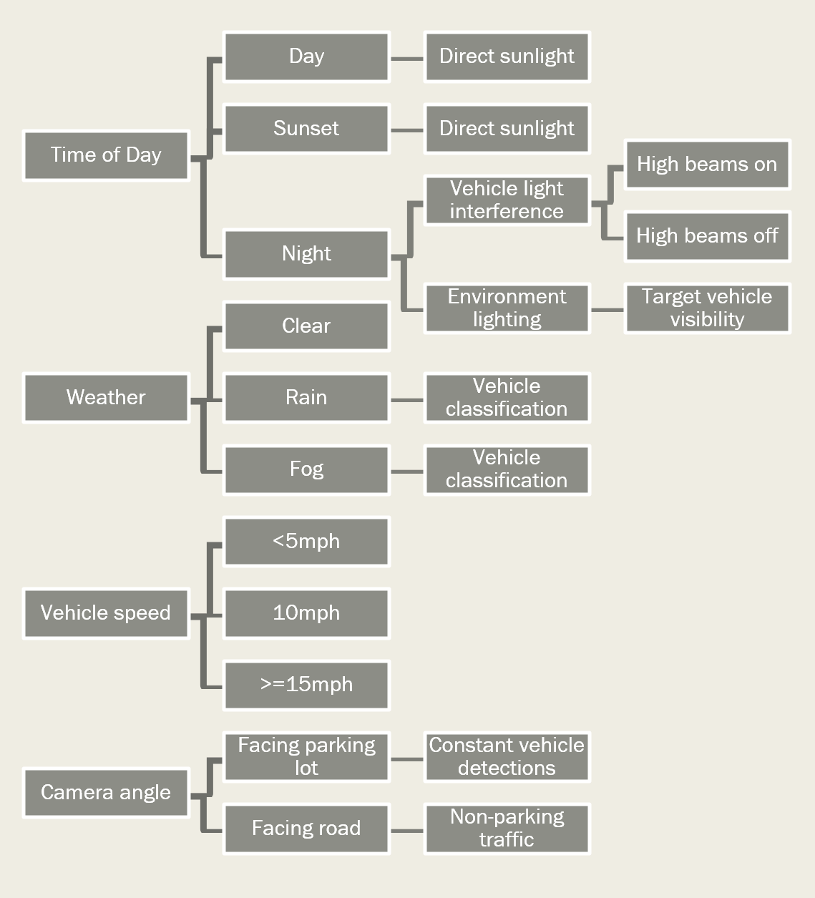
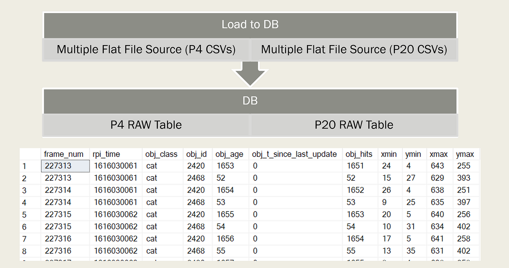
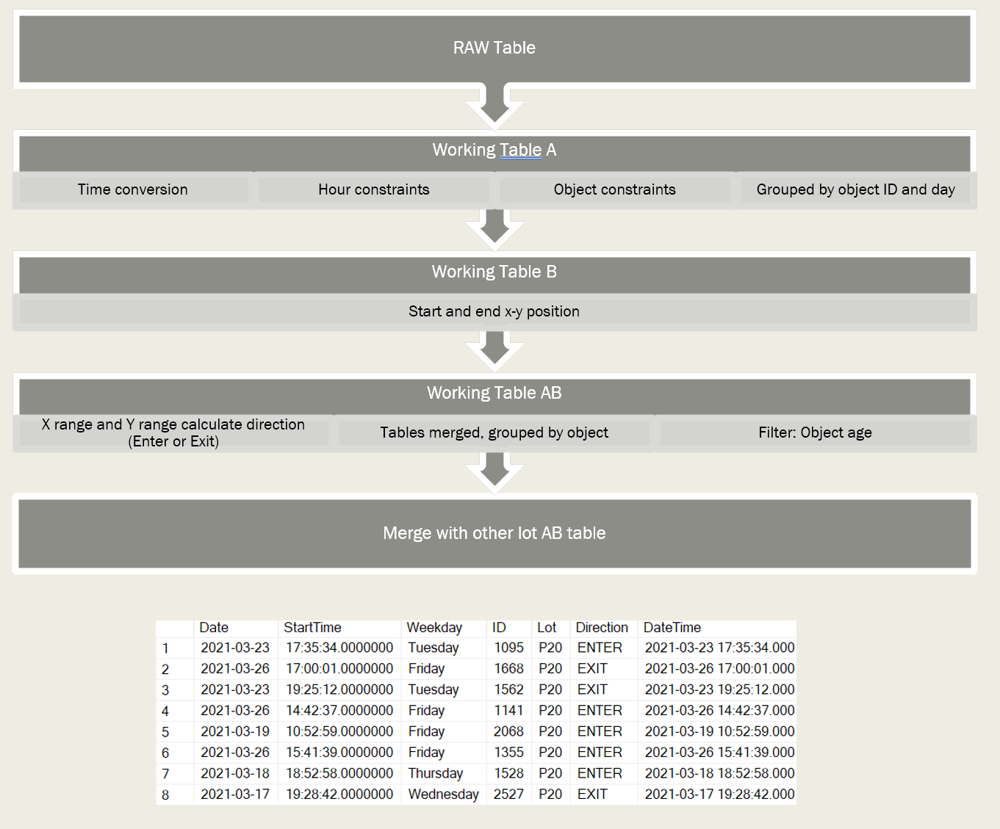
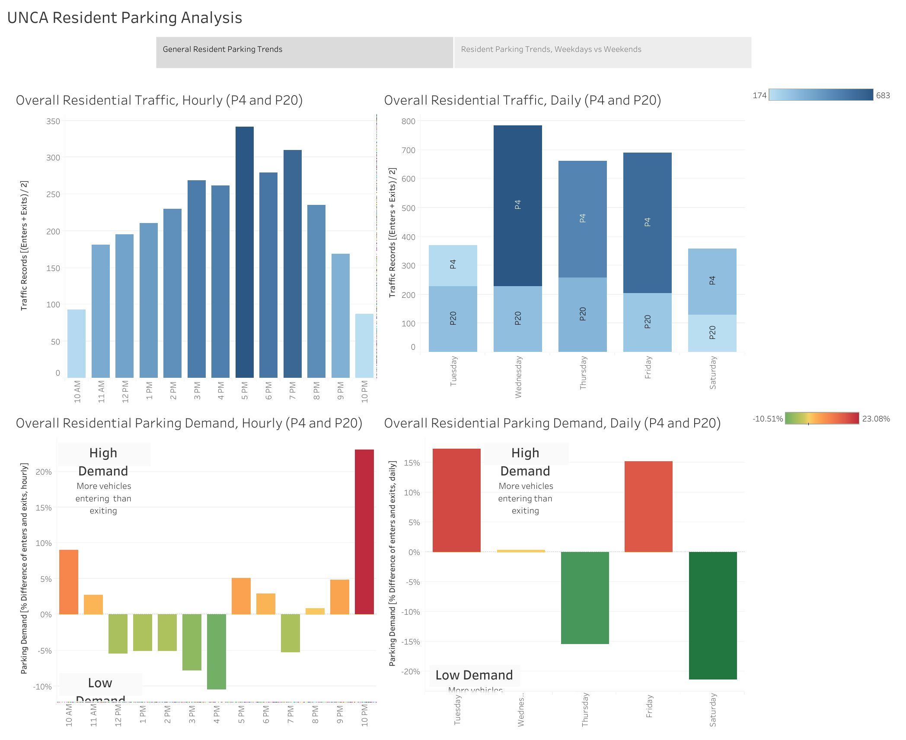
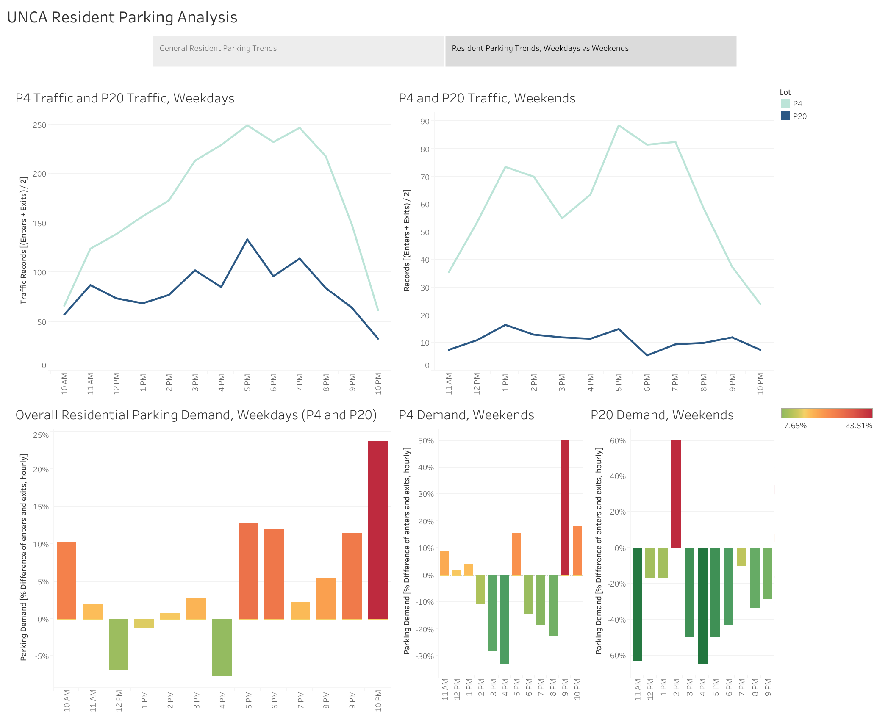

Residential parking lot closures at my university created excessive demand for parking.

Shortly after the start of the Fall 2020 semester, my university cut off access to half of the residential parking spaces available near my dorm. Finding parking as a resident on campus was hard enough as it was before that happened. Upon contacting the university regarding  _why_ the parking deck was closed off, I did not receive a transparent response.

Finding a parking spot in the fall semester after getting back home late from my job was like an animal desperately hunting for prey. And that’s not exaggerating. I often had to camp in my car for a while to find a parking spot, and that wasn’t cutting it. I noticed there were some trends as to when there were more parking spaces available, which raised a thesis-worthy question: when am I most likely to return to campus and find a parking space successfully? How can I use this information to my own benefit to make sure I’m not making a hike back to my dorm in the cold after work again?

My statistics professor and advisor was kind enough to oversee this project, and the research design began.

I have a GitHub repository that I made significant changes to after forking from Nathan Rooy’s original. You can view the repo here at any time:  [https://github.com/hainesdata/rpi-urban-mobility-tracker](https://github.com/hainesdata/rpi-urban-mobility-tracker)

## Data Collection

To answer the questions raised above, I would first need to gather data. Because I had absolutely no background in civil engineering whatsoever, I researched ways I could collect traffic data.

I had no access to Maps data from Google or Apple, so gathering data from people’s location would not suffice. Another option I could have used was one of the most widely used methods, something you may have seen on the road previously — pneumatic tube counters. These “count” vehicles that drive over the tubes whenever there is a difference in pressure between the tubes. However, these systems are quite expensive for an undergraduate student attending a university with a low research budget. They run upwards of $500 USD each, and the municipality which I study in was unwilling to lend or rent out vehicle counters.

So, from that point, I only had two options left. I decided on building a Raspberry Pi surveillance system that records footage and later identifies direction of travel of the vehicles using a TensorFlow model — the other option wouldn’t have been very efficient…or warm.

**I discuss how I put the system together in depth** [**here**](project/parking-vision)**.**  Getting this system up and running took hours on end of troubleshooting and constant running back and forth. Overall, it took about a month and a half, and a few ounces of sanity, before I was able to do field testing. Hopefully, if you plan on replicating this, the guide will save you that time and frustration. I can’t say you won’t run into more problems during field testing and even the actual data collection (like battery issues, SD cards snapping, memory leaks, weather…), so brace yourself for the unexpected. Murphy’s Law.

Basically, the Raspberry Pi system runs a Tensorflow Lite application using an object detection model. The model selected is Coco SSD Mobilenet v1.1. It’s not the most accurate model, but it does classify cars (those moving in and out of parking lots) accurately, so it worked just fine for this usage. Data can be stored in a series of images using a flag when running the application, but over the course of a day of collection, that caused memory leaks due to the application running in a Docker container. However, every frame of detections are stored in a CSV, which can be used for further analysis.

### Field Testing

I spent a little over a week testing the systems outside. There was a lot of me driving back and forth, while I tested the model against every use case I possibly could — I had campus police called on me twice, as my lanky self in my hoodie, with a university parking permit on the back of my car, somehow translates to a suspicious character. I eventually emailed the police details of my study and when I would be working on it to make them aware of this, you may run into similar issues, so be aware of that.

Each use case is detailed below in a UML diagram I put together for this article:

I tested every one of them and tried several angles until I could verify that the model was detecting my car (and other cars that drove by while I was doing it) accurately. Once I was able to find the “sweet spots”, I could try running the first full-day test. Which, by the way, the first day lead me to buying batteries with a larger capacity. This was probably the most intense research I’ve done on Amazon in a while, since I had to be sure that the battery would fit in the enclosures. Additionally, I discovered I had memory leaks and the application was killing itself intermittently. I detailed this in my how-to article on building the system, but I was able to solve those issues within a few days thanks to UMT’s original designer,  [Nathan Roo](https://nathanrooy.github.io/)y, being kind enough to help me on LinkedIn while I was troubleshooting.

Finally, once the larger batteries arrived and all runtime issues were fixed, I could run the model successfully for a full day, and charge the battery to full capacity overnight. At this point, I was set to begin collecting data.

### Collection Phase

I planned on collecting data over the course of 4 weeks (28 days), from two different residential parking lots. I needed to record at a quality low enough that license plates were not discernible, so I could get an exemption from the IRB, which allows me to proceed without having to wait for IRB approval of the study. After getting the exemption, for good measure, my professor contacted the transportation committee at my university to receive permission to use these systems.

Once I tested the system outside, finished troubleshooting, and got the necessary approvals, I was free to begin officially collecting and storing data. Every morning at around 8AM I set up the systems outside, rain or shine. They run all day until I go out at around 11:15PM to collect them and pull the day’s CSVs off of them, and charge the batteries overnight. In a day, one system records roughly 260,000 frames, and around 96,000 of those frames have object detections stored in the CSV. 96,000 frames at approximately 4fps = 6h 40m of detections — most of which would be pedestrians, vehicles driving by the parking garage, buildings, etc. — detections that would otherwise be irrelevant for my intended analyses. This would need some major cleaning and filtering was needed, so while I was still collecting I began creating an ETL template with the data I already had.

## ETL & Data Wrangling

### Architecture

In the end, I was opting for 2 separate tables, containing all detections across the 4 weeks that were relevant (cars entering and exiting the parking garage). To do so, I’d have to use the following format:

### SSIS

I imported data collected from all CSVs into a database, where there were two separate tables for each lot, containing entries across all days.

### Wrangling in SQL

Once I had everything imported into the database, I had to start transforming the data. I was working with approximately 584,000 (P20) + 841,000 (P4) = 1.4 million rows of data, which was no good for analysis. Through a series of various transformations (as detailed in the flowchart below), I was able to condense that down to just 8,500 rows of relevant data. This was far more efficient for analysis. The resulting “master” DRV table that would be used for analysis is shown below as well.

The query I used for data transformation is available on Github. If you’re curious, it’s located in the  [project repository](https://github.com/hainesdata/rpi-urban-mobility-tracker), in the  **etl** directory  [here](https://github.com/hainesdata/rpi-urban-mobility-tracker/blob/master/etl/ParkingETL.sql).

Once this was done and exported to a single CSV in SSIS, I was ready for analysis of the data.

## Analysis

For the analysis, I chose to use Tableau, since Tableau offers the most straightforward process of quickly creating visualizations.

My focus for the analysis was on time-series data. I looked at weekday vs weekend, where I had seen obvious differences in the overall availability of parking in both lots. I also looked at the hours of the day on weekend and weekdays separately, and overall, and created a simple model to represent the probability of there being an open space in the lot.

### Model

I created two important models for the analysis. The first is designed to measure the overall traffic records recorded  _R(t)_ in any given unit of time,  _t:_

$$
R(t) = \frac{n(t) + x(t)}{2}
$$

_n(t)_ represents the number of  e**n**trances in a given unit of time, and _x(t)_ represents the number of  e**x**its in a given unit of time.

The second model is used to predict the demand, or likelihood of finding an open parking spot in a given unit of time  _t_, _D(t)_. It is the percent difference of enters and exits relative to the number of exits, so it effectively shows when there are more entrances than exits (positive %) or less entrances than exits (negative %), which is a predictor of whether there will be an open space at any given time.

$$
D(t) = \frac{n(t)-x(t)}{x(t)}
$$

### Visualizations

**NOTE:** data was excluded from the overall traffic analysis. Only dates which had entries from  _both parking lots were included, as to avoid bias towards any particular parking lot. That is why not every weekday is seen on the analysis of weekdays._

In the analysis that is reflective of the  **general resident traffic** (traffic measured across both parking lots), here are the expected findings which are proven by the data:

-   **Peak overall traffic is at 5PM.** This is an obvious one — not only through pure observation but also through inference. 5PM is rush hour, and most students are out of class by that time. It should be noted that this is simply  _traffic_, not the actual predictor of an open parking spot. This just states how busy it is.
-   **Saturday has the least traffic of any weekday.** Weekends overall were observably less busy and had more open spaces. Through inference, this is also true because of the fact that most students attending the university are in-state students, meaning many students often commute back home for the weekends.
-   **Finding an open parking spot after 9PM is highly unlikely.** This has been true through personal experience. There is hardly any traffic at 10PM, for example. Moreover, the demand calculation at 10PM is the highest all day, meaning that there is virtually no chance of finding parking, even if you patiently wait for a spot to open up.

Now, there were a few anomalies that stood out:

-   **Tuesday has the most demand.** This is possibly because people come back from the weekend on Tuesdays.
-   **Thursday sees the least demand of weekdays.** There are often people who don’t have class on Fridays. This could be an example of people leaving for the weekend, or people going out more on Thursdays, thus leaving more parking spaces available overnight.
-   **Friday has high demand.** This was an interesting one, since I expected to have seen  _less_ demand on Friday due to people leaving for the weekend. It is possible that this is reflective of parties happening on Friday, specifically on campus, so there are many people who don’t leave on Fridays.
-   **The demand for parking flips from 12–4PM to 5PM.** This provides insight on what is probably students leaving for lunch, and then leaving to go out after their classes are finished for the day. Then, at 5–6PM people return and fill any open parking spaces.
-   **Demand for parking is negative at 7PM.** Dinner time.

It is important to note, that again, these findings are reflective of  **overall resident student parking.** They are not separated by weekday, and the data includes the difference seen between weekends and weekdays, which are further detailed below.

This analysis separates between weekdays and weekends, and also looks at the trends between the two lots at those times. For weekdays, there was not much difference seen in the seasonal traffic trends between lots, so the demand could be looked at across  _all_ entries in both lots. For weekends, however, there was a clear difference in seasonality, specifically between 1PM and 4PM, and after 7PM.

In weekdays, similar trends were seen to the overall analysis. The findings are detailed:

-   **The 10PM demand is the same as seen in overall resident parking trends.**
-   **Afternoon demand is more precise than overall.** Weekday afternoons exhibit low demand specifically at noon, probably due to students going out for lunch, and at 4PM, which is probably students leaving for grocery shopping, dinner, and hanging out.
-   **After 4PM, there is high demand.**  This is probably due to students coming back from whatever they went out to do.

Weekends also exhibited very interesting peaks in demand, despite having mostly low demand. There is also lower demand overall on weekends in the P20 lot. This could be due to the fact that P20 is closer to freshman residence halls, and are strictly for resident parking permits and  _not_ freshman parking permits. So, when people leave for the weekend, there is not as much demand for P20 during the weekend as there is for P4 — there are more people using the P4 lot over the weekend since P4 covers more residence halls not designed for freshman. It is also possible there are more out-of-state students living in the dorms closer to P4 than P20, which those students do not leave for the weekend, resulting in less open spaces.

## Conclusion

This project was  **very** time-consuming and hopefully could provide some insight to not only students but faculty and staff as well. This was a “full-stack” data science project, which was a study done from scratch. I anticipate continuing this research at NC State, or passing on the research to someone else at UNCA.

Additionally, I presented this project at Wake Forest University’s IRIS conference and UNCA’s statistics symposium in Spring 2021. The slides are available  [here](https://github.com/hainesdata/rpi-urban-mobility-tracker/blob/master/ML%20Parking%20traffic%20analysis.pdf).

If you’d like to reach out for any reason, please don’t hesitate! I am best reachable through LinkedIn or email.